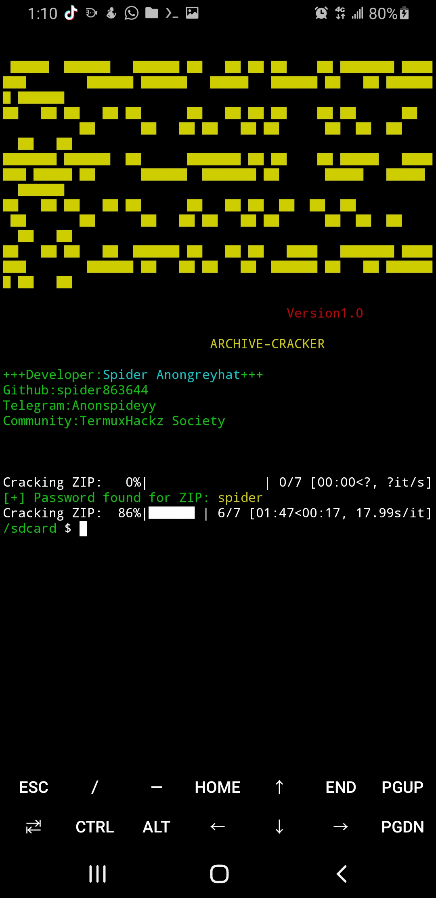

# Archive-Cracker

A fast, multithreaded password cracker for `.zip` and `.rar` archives using Python.

**Developer:** Spider Anongreyhat  
**GitHub:** [@spider863644](https://github.com/spider863644)  
**Telegram:** [Anonspideyy](https://t.me/Anonspideyy)  
**Community:** TermuxHackz Society

---

## Features

- Cracks ZIP and RAR archives using a wordlist
- Multi-threaded for faster password cracking
- Automatically detects if the archive is password-protected
- Real-time progress bar with `tqdm`
- Clean terminal output with colored formatting

---

## Installation

1. **Clone the repository:**

```bash
git clone https://github.com/spider863644/Archive-Cracker.git
cd Archive-Cracker
```
2. **Install dependencies:**
```
pip install -r requirements.txt
```
> If you're cracking RAR files, make sure `unrar` is installed on your system:
>
> - **Linux:** `sudo apt install unrar`
> - **Termux:** `apt install unrar`
> - **Windows:** Make sure `unrar.dll` is available or configure `rarfile` correctly.

---

## Usage
```
python3 archive_cracker.py <zip/rar> <archive_path> <wordlist_path>
```

### Example:
```
python3 archive_cracker.py zip secret.zip rockyou.txt
```

---

## Arguments

| Argument          | Description                        |
|-------------------|------------------------------------|
| `zip` / `rar`     | Type of archive to crack           |
| `<archive_path>`  | Path to the ZIP or RAR file        |
| `<wordlist_path>` | Path to the wordlist file to use   |

---

## Screenshot



---

## Disclaimer

This tool is intended for **educational and ethical purposes only**.  
The developer is **not responsible** for any misuse.

---

## Connect

- **Telegram:** [Anonspideyy](https://t.me/Anonspideyy)
- **GitHub:** [spider863644](https://github.com/spider863644)
- **Community:** TermuxHackz Society

---

**Version 1.0** | Built with passion by **Spider Anongreyhat**
